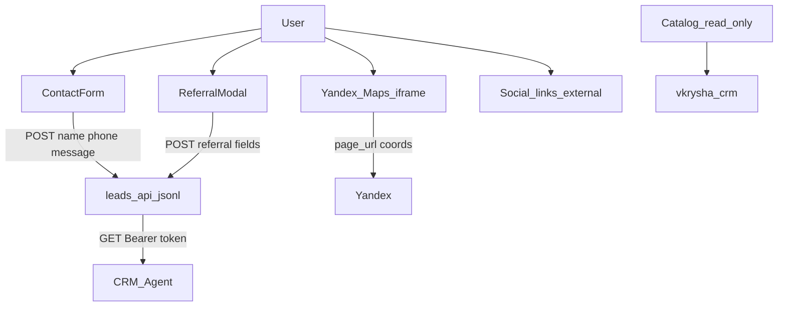

# LEGAL_AUDIT — первичный аудит vkrysha.ru

Дата: 2026-10-06.  
Стек: Vite + React SPA, nginx, leads-api (Node), CRM `vkrysha-crm.ru`.

## Карта потоков ПДн

| Поток | Данные | Куда | Цель | Основание (заявлено) | Хранение | Третьи лица | Иностранная инфра | Cookies | Отключение | Без согласия |
|-------|--------|------|------|----------------------|----------|-------------|-------------------|---------|------------|--------------|
| ContactForm | имя, телефон, сообщение, page | `/api/leads` → jsonl | Обратная связь | checkbox + политика | VPS leads.jsonl | CRM-агент по API | Неизвестно | localStorage consent | Не применимо к заявке | Submit заблокирован без checkbox |
| ReferralModal | ФИО/тел друга и рекомендателя, messenger | `/api/leads` | Реферальная программа | **нет UI согласия** | VPS | CRM-агент | Неизвестно | sessionStorage dismiss | Закрыть модалку | **Отправка возможна без согласия** |
| Яндекс.Карты | адрес/координаты, IP браузера | yandex.ru iframe | Показ карты объекта | не раскрыто | у Яндекса | ООО Яндекс | РФ (сервис) | third-party возможны | Не загружать карту | iframe грузится при открытии объекта |
| CRM catalog | без ПДн пользователя | vkrysha-crm.ru | Каталог | n/a | CRM | CRM | Неизвестно | — | — | — |
| Cookie banner | выбор consent | localStorage | UX | клик | браузер | нет | — | key `vkrysha_cookie_consent` | Отклонить | Аналитика в коде и так не грузится |
| Соцсети | клик → внешний сайт | t.me / wa.me / vk / youtube | Связь | клик пользователя | у платформ | платформы | частично | у платформ | не кликать | не передаём сами |

## Таблица нарушений

| ID | Проблема | Страница / код | Закон/норма | Риск | Исправление | Статус |
|----|----------|----------------|-------------|------|-------------|--------|
| L01 | Рефералка собирает ПДн (в т.ч. третьего лица) без checkbox согласия | `ReferralModal.tsx` | 152-ФЗ ст. 6, 9 | CRITICAL | Добавить согласие + ссылки на политику; пояснение про данные друга | fixed |
| L02 | ContactForm: дублирующее «нажимая кнопку соглашаетесь» + checkbox; согласие не отделено от кнопки по смыслу ч. 3 ст. 9 | `ContactForm.tsx` | 152-ФЗ ст. 9 ч. 3 (ред. с 01.09.2025) | HIGH | Убрать ложное «согласие кнопкой»; оставить явное согласие отдельным действием | fixed |
| L03 | Политика: «использование Сайта = согласие» | `PrivacyPage.tsx` | 152-ФЗ ст. 6, 9 | HIGH | Убрать конструкцию; согласие только через формы/cookie-выбор | fixed |
| L04 | Политика cookie: «используя сайт соглашаетесь» + ложная Яндекс.Метрика | `CookiesPage.tsx` | 152-ФЗ; соответствие фактической обработке | HIGH | Привести к факту: Метрики нет; описать localStorage + карты | fixed |
| L05 | Cookie UI обещает аналитику/маркетинг, но скриптов нет; настройки футера нет | `CookieConsent.tsx`, Footer | достоверность информации 149-ФЗ | HIGH | Упростить баннер под факт; кнопка повторных настроек в футере | fixed |
| L06 | Политика утверждает «ПДн никогда не передаются третьим лицам», но заявки отдаются CRM-агенту и карты — Яндексу | `PrivacyPage.tsx`, leads API, `PropertyMap.tsx` | 152-ФЗ ст. 6, 7, 9 | HIGH | Раскрыть получателей: CRM, агент по API, Яндекс.Карты | fixed |
| L07 | Политика перечисляет email, регистрацию, персонализированные ресурсы — на сайте этого нет | `PrivacyPage.tsx` vs формы | 152-ФЗ принцип соответствия целям | MEDIUM | Синхронизировать состав данных с фактическими формами | fixed |
| L08 | Нет отдельного документа/текста согласия на ПДн (при том что политика ссылается на ч. 3 ст. 9) | нет `/consent` | 152-ФЗ ст. 9 | HIGH | Страница согласия + ссылка из форм | fixed |
| L09 | Нет отдельного согласия на рекламные коммуникации, но политика упоминает рассылки | `PrivacyPage.tsx` | 38-ФЗ ст. 18; 152-ФЗ | MEDIUM | Убрать обещание рассылок или отдельный checkbox | fixed |
| L10 | Абсолютные/рисковые утверждения: «Ключи за 3 дня», «Ипотека от 4%», «Лучшие цены», «Юр. защита» | `Hero.tsx` | 38-ФЗ (достоверность рекламы) | HIGH | Смягчить формулировки | fixed |
| L11 | «Проверим юридическую чистоту», «Одобрение в 15+ банках», «до 50 млн ₽» без оговорок | `Services.tsx` | 38-ФЗ; ЗОЗПП | HIGH | Смягчить / добавить «при наличии оснований» | fixed |
| L12 | Оферта ссылается на Правила розничной купли-продажи (ПП РФ 2463) — сомнительно для риэлторских услуг | `OfferPage.tsx` | ГК РФ; ЗОЗПП | MEDIUM | Убрать неуместную отсылку; оставить релевантные нормы | fixed |
| L13 | Банковские реквизиты hardcoded, не из CRM | `OfferPage.tsx` | достоверность | MEDIUM | Оставить с TODO владельцу в LEGAL_ASSUMPTIONS | owner |
| L14 | Отзывы захардкожены, подлинность не подтверждена | `Reviews.tsx` | 38-ФЗ (если реклама) | MEDIUM | Пометка / TODO владельцу | partial |
| L15 | GET `/api/leads?token=` допускает токен в URL (логи, Referer) | `server/leads-api/index.js` | защита ПДн / security | HIGH | Только Authorization Bearer | fixed |
| L16 | Нет captcha / honeypot на формах | ContactForm, Referral | spam → избыточная обработка ПДн | MEDIUM | Honeypot + уже есть rate-limit | partial |
| L17 | Локализация первичной записи ПДн не доказана | VPS, CRM | 152-ФЗ ст. 18 (локализация) | HIGH (вне кода) | TODO владельцу — см. LEGAL_ASSUMPTIONS | owner |
| L18 | Уведомление Роскомнадзора не проверено | вне сайта | 152-ФЗ ст. 22 | HIGH (вне кода) | TODO владельцу | owner |
| L19 | Яндекс.Карты без предупреждения о третьей стороне | `PropertyMap.tsx` | 152-ФЗ / информирование | MEDIUM | Подпись под картой | fixed |
| L20 | Cookie policy обещает кнопку в футере — кнопки нет | CookiesPage vs Footer | достоверность | MEDIUM | Добавить кнопку | fixed |
| L21 | Нет CSP / security headers в репозитории nginx | deploy/ | security best practice | LOW | snippet headers | partial |
| L22 | Права на фото объектов/галереи | CRM media | ГК РФ IV | INFO | TODO владельцу | owner |

## Категории исправления

| ID | Категория |
|----|-----------|
| L01–L12, L14–L16, L19–L21 | A — код / документы на сайте |
| L13, L17, L18, L22 | C/F — данные и действия владельца |
| L17 | E — инфраструктура |
| L18 | G — юрист / РКН |

## Что НЕ найдено в коде

- Яндекс.Метрика / GA / GTM / пиксели
- Чат-виджеты, calltracking
- Captcha
- Email/SMS gateway с сайта
- User accounts / личный кабинет
- `.env` с секретами во frontend (`CRM_SITE_TOKEN` без `VITE_`)
